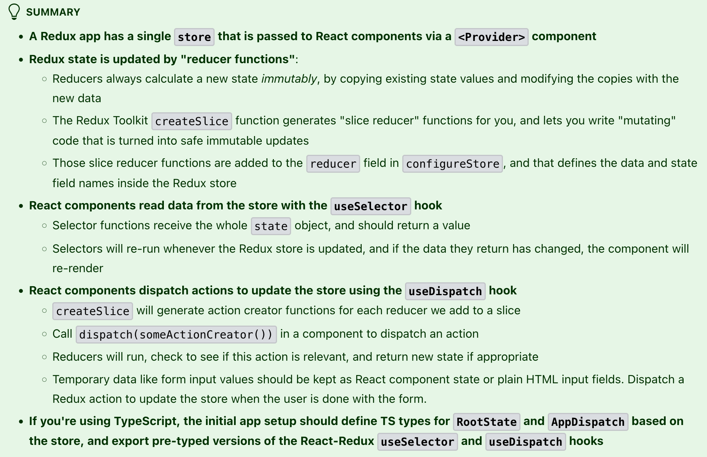
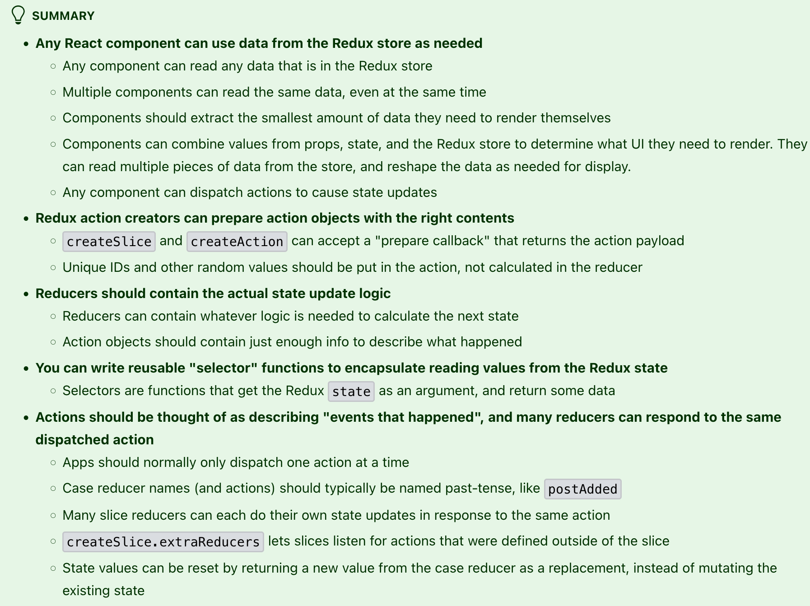
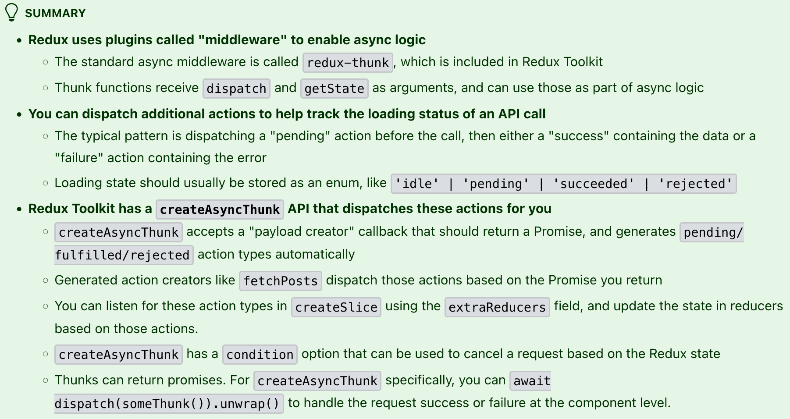

# Redux

## Resources

- https://redux.js.org/introduction/getting-started
- https://redux.js.org/tutorials/essentials/part-1-overview-concepts

## Notes

> Redux is a pattern and library for managing and updating global application state, where the UI triggers events called "actions" to describe what happened, and separate update logic called "reducers" updates the state in response.

> One of the principles of Redux is that there should only be one store instance for an entire application.
>
> In a typical Redux app, there is just a single store with a single root reducer function. As your app grows, you split the root reducer into smaller reducers independently operating on the different parts of the state tree. This is exactly like how there is just one root component in a React app, but it is composed out of many small components.

> The patterns and tools provided by Redux make it easier to understand when, where, why, and how the state in your application is being updated, and how your application logic will behave when those changes occur.

> This is a small example of "one-way data flow":
> - State describes the condition of the app at a specific point in time
> - The UI is rendered based on that state
> - When something happens (such as a user clicking a button), the state is updated based on what occurred
> - The UI re-renders based on the new state

> Global state that is needed across the app should go in the Redux store. State that's only needed in one place should be kept in component state.

> All the new features we'll add after this will follow the same basic patterns you've seen here: adding slices of state, writing reducer functions, dispatching actions, and rendering the UI based on data from the Redux store.

- dispatching two actions in a row is usually a sign that we need to rethink how we're defining our logic
  -  `extraReducers` can be used to have the slice listen for actions that were defined elsewhere in the app -- anytime those other actions are dispatched, this slice can update its own state as well
     -  many different slice reducers can all respond to the same dispatched action and each slice can update its own state if needed
     - https://redux.js.org/tutorials/essentials/part-4-using-data#using-extrareducers-to-handle-other-actions

## Key Concepts

- **store** -- where global state of the application is stored
  - `store.getState` returns the current state value
- **action** -- An action is a plain JavaScript object that has a type field. You can think of an action as an event that describes something that happened in the application.
  - `type` should be a string that gives the action a descriptive name
  - `payload` additional information about what happened
  - **action creator** is a function that creates and returns an action object
- **reducer** -- function that receives the current `state` and an `action` object, decides how to update the state if necessary, and returns the new state: `(state, action) => newState`.
  - Reducers must always follow some specific rules:
    - They should only calculate the new state value based on the state and action arguments
    - They are not allowed to modify the existing state. Instead, they must make immutable updates, by copying the existing state and making changes to the copied values.
    - They must be "pure" - they cannot do any asynchronous logic, calculate random values, or cause other "side effects"
- **dispatch** -- The only way to update the state is to call `store.dispatch()` and pass in an action object.
  - reducers act like event listeners, and when they hear an action they are interested in, they update the state in response.
- **selectors** -- functions that know how to extract specific pieces of information from a store state value. As an application grows bigger, this can help avoid repeating logic as different parts of the app need to read the same data:
- **thunk** -- specific kind of Redux function that can contain asynchronous logic
- **slice** -- collection of Redux reducer logic and actions for a single feature in your app

### Hooks

- `useSelector(state => state.count)` extracts the current data from the store
- `useDispatch` returns the dispatch function used to send actions to the redux store
  - use `.withTypes` to declare `(state: Rootstate)` in every TS file

### Thunks

**thunk** -- piece of code that does some delayed work ([wiki](https://en.wikipedia.org/wiki/Thunk))

- not all web requests are synchronous, some things can be done using the async paradigm
- Redux by itself does not understand async functions, but you can use middleware to evaluate async logic as needed
- Thunk functions will always be called with (dispatch, getState)
  - thunk functions have the following states after calling -- `pending`, `fulfilled`, `rejected`
    - will need to add cases to `extraReducers` for these states so we can update the global state
    - can also put them in a single create slice if we use the factory method of creating a slice
  - create an "action creator" and dispatch like normal
  - can have conditions to ensure we don't fetch / send async requests multiple times

```typescript
export const fetchPosts = createAppAsyncThunk('posts/fetchPosts', async () => {
  const response = await client.get<Post[]>('/fakeApi/posts')
  return response.data
})
```

## Example

### Configure Store

```typescript
import type { Action, ThunkAction } from '@reduxjs/toolkit'
import { configureStore } from '@reduxjs/toolkit'
import counterReducer from '@/features/counter/counterSlice'

export const store = configureStore({
  reducer: {
    counter: counterReducer
  }
})
```

- When we pass in an object like `{counter: counterReducer}`, that says that we want to have a `state.counter` section of our Redux state object, and that we want the `counterReducer` function to be in charge of deciding if and how to update the `state.counter` section whenever an action is dispatched.

### Extra Reducers

[Read More](https://redux.js.org/tutorials/essentials/part-4-using-data#using-extrareducers-to-handle-other-actions)

```typescript
import { createSlice, nanoid, PayloadAction } from '@reduxjs/toolkit'
import { sub } from 'date-fns'

import { userLoggedOut } from '@/features/auth/authSlice'

// omit initial state and types

const postsSlice = createSlice({
  name: 'posts',
  initialState,
  reducers: {
    postAdded: {
      // omit postAdded and other case reducers
  },
  extraReducers: (builder) => {
    builder.addCase(userLoggedOut, (state) => {
      return []
    })
    builder.addMatcher(matcherFunction, caseReducer)
    builder.addDefaultCase(caseReducer)
  },
})
```

## Summaries

### Basic Redux Data Flow



### Using Redux Data



### Async Logic and Data Fetching



## Things to Look into

- [ ] https://github.com/reduxjs/redux-devtools
- [ ] middleware and enhancers
- [ ] [What is Redux? Get A Senior Understanding of How Redux Works](https://youtu.be/BnBtzED2-GE?si=dYZq5lBXKeI4L4N9)
- [ ] [Lets Learn Modern Redux](https://youtu.be/9zySeP5vH9c)
- [ ] [Using Redux: Writing Logic with Thunks](https://redux.js.org/usage/writing-logic-thunks)
  - how to handle thunk promise rejections with error
